# Práctica 7: Introduccción a CI-CD.

## 1. Introducción y conceptos clave a CI-CD.

### 1.1. Significado de CI-CD.

La abreviatura CI/CD corresponde a "Integración Continua" (Continuous Integration) y "Entrega o Despliegue Continuo" (Continuous Delivery/Deployment).

Se puede definir CI/CD como un conjunto de metodologías que ayudan a los equipos de desarrollo de software a automatizar procesos como la integración de código, la ejecución de pruebas y la implementación de aplicaciones de forma ágil y confiable.

CI (Integración Continua): Esta práctica implica incorporar los cambios realizados en el código fuente de una aplicación dentro de un repositorio común. Para asegurar la compatibilidad del nuevo código con el ya existente, es necesario que este pase diversas pruebas (unitarias, de integración, entre otras) que certifiquen su correcto funcionamiento.

CD (Entrega/Despliegue Continuo): Una vez comprobado que el código no presenta errores, el proceso de CD se encarga de automatizar su entrega e implementación en los diferentes entornos definidos, como pueden ser los de pruebas, preproducción o producción.

### 1.2. Pipelines.

Un pipeline es una cadena de pasos automatizados que se ejecutan de manera secuencial con el objetivo de compilar, probar e implementar software. Cada uno de estos pasos se conoce como etapa (stage), y puede incluir actividades como:

- La compilación del código fuente.

- La ejecución de pruebas (unitarias, de integración, entre otras).

- La generación de artefactos, como por ejemplo una imagen de Docker.

- La implementación en distintos entornos, tales como pruebas, preproducción o producción.

Normalmente, los pipelines se configuran mediante archivos escritos en formato YAML.

En el caso de GitHub Actions, estos pipelines reciben el nombre de workflows.

## 2. Objetivos de esta práctica.

- Integración Continua (CI) con GitHub Actions.

Se configurará la automatización de la ejecución de pruebas unitarias cada vez que se realice un push a la rama principal (main).

- Entrega Continua (CD).

Una vez superadas las pruebas unitarias, se automatizará la generación y publicación de una imagen Docker en Docker Hub.

- Despliegue Continuo (CD).

El siguiente paso será automatizar el proceso de despliegue de dicha imagen Docker en la infraestructura de AWS.

## 3. Estructura del proyecto.

Con el objetivo de realizar esta práctica, en primer lugar, se ha realizado un fork de este [repositorio](https://github.com/josejuansanchez/ci-cd-flask). El usuario debe recordar que ya se explicó detalladamente [cómo realizar un fork](https://github.com/djesuscp/WAD_Practice3.1) en una práctica anterior, por lo que se le invita a volver a la misma para recordar el proceso.

Asimismo, se ha clonado el repositorio propio que incluye el fork en la máquina que servirá para realizar la práctica.

Dicho repositorio consta de:

- Aplicación Flask: ubicada en el directorio: `/src/app.py`.

- Pruebas unitarias situadas en el directorio: `/test/test.py`.

- Archivo `requirements.txt` que alberga las dependencias requeridas para la ejecución de la aplicación y las pruebas unitarias.

- Archivo `.yml` de workflow que se encarga de ejecutar unas pruebas que, si devuelven un resultado correcto, dejarán paso a la creación de la imagen Docker, para finalmente subir la imagen a Docker Hub. Además, el workflow contiene dos disparadores o "triggers": el arranque manual del workflow, y el evento git push.

- Un archivo Dockerfile configurado para específicamente para esta aplicación, en el cual se detallan tanto el entorno, como las instrucciones necesarias para llevar a cabo la construcción de la imagen Docker.

### 3.1. Contenido del archivo de workflow.

En esta ocasión, se ha empleado un archivo `.yml` con el siguiente contenido:

```
name: CI/CD Preproduction

on:
  push:
    branches:
      - main
  workflow_dispatch:

env:
  # github.repository = <account>/<repo>. Example: josejuansanchez/ci-cd-python
  #IMAGE_NAME: ${{ github.repository }}
  IMAGE_NAME: ci-cd-python

jobs:
  test:
    runs-on: ubuntu-latest
    steps:
      - uses: actions/checkout@v2
      - name: Set up Python
        uses: actions/setup-python@v2
        with:
          python-version: '3.13'
      - name: Install dependencies
        run: |
          python -m pip install --upgrade pip
          pip install -r requirements.txt
      - name: Run tests
        run: |
          python -m unittest discover tests

  build-and-push:
    needs: test
    runs-on: ubuntu-latest
    steps:
      - uses: actions/checkout@v2
      - name: Log in to Docker Hub
        run: echo "${{ secrets.DOCKER_HUB_TOKEN }}" | docker login -u "${{ secrets.DOCKER_HUB_USERNAME }}" --password-stdin
      - name: Build Docker image
        run: docker build -t ${{ secrets.DOCKER_HUB_USERNAME }}/${{ env.IMAGE_NAME }}:latest .
      - name: Push Docker image
        run: docker push ${{ secrets.DOCKER_HUB_USERNAME }}/${{ env.IMAGE_NAME }}:latest
```

Es conveniente que, para comprender las instrucciones del siguiente apartado, el usuario sea capaz de entender la funcionalidad de este archivo:

- `name`: define el nombre del workflow (flujo de trabajo), siendo el título que aparecerá en la pestaña Actions de GitHub para identificar este flujo.
- `on`: indica cuándo debe ejecutarse el workflow, determinando que se active cuando un push en la rama main, y permitiendo al usuario ejecutar un workflow manual desde la interfaz de GitHub con el botón "Run workflow" gracias a la declaración "workflow_dispatch".
- `env`: define las variables de entorno globales, accesibles en todos los jobs.
- `jobs`: define los distintos trabajos (jobs) que se ejecutarán en este flujo. Este workflow tiene dos jobs: test y build-and-push.
- `test`: determina que se ejecuta sobre un entorno Ubuntu y realiza las pruebas del código. Paso a paso, se centra en: clonar el repositorio, instalar python y las dependencias necesarias para el proyecto, y finalmente ejecuta los test.
- `build and push`: se encarga de construir la imagen y subirla a Docker Hub con el login correcto gracias a instrucciones automatizadas que extraen las variables secretas configuradas en el GitHub del usuario. Esto nunca se ejecuta si alguno d elos test falla.

## 4. Instrucciones.

Este proyecto está basado en la [práctica anterior](https://github.com/djesuscp/WAD_Practice5.4_2048.git), por lo que se recomienda al usuario que acceda al enlace proporcionado para revisarla, pues se debe configurar el mismo entorno, creando la imagen configurada en el repositorio propio que ha recibido el fork, publicándola en Docker Hub con GitHub Actions.

### 4.1. Comprobación de los test predeterminados.

Una vez realizado esto, en su repositorio forkeado, el usuario podrá acceder al apartado de "Actions" y podrá hacer click sobre el botón "Run workflow" para ejecutar el primer proceso de workflow manual y probar el funcionamiento de los test.

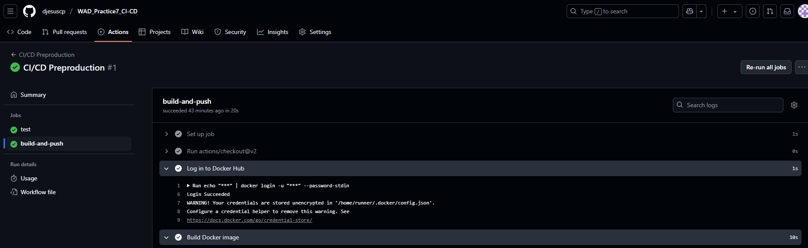

### 4.2. Comprobación de nuevos test. Fallo en el test.

Con el propósito de comprobar que los workflows funcionan correctamente, se han elaborado nuevos test en la aplicación, forzando uno de ellos a fallar para mostrar al usuario el funcionamiento de GitHub Actions y la información proporcionada por esta interfaz.

De este modo, a continuación, se muestra una captura de pantalla del commit realizado tras implementar los nuevos test (tanto el que falla como el que pasa correctamente). En esta imagen se aprecian los cambios realizados en los scripts de python encargados de ejecutar la aplicación y los test que comprueban su funcionamiento antes de subir esta nueva imagen a Docker Hub.

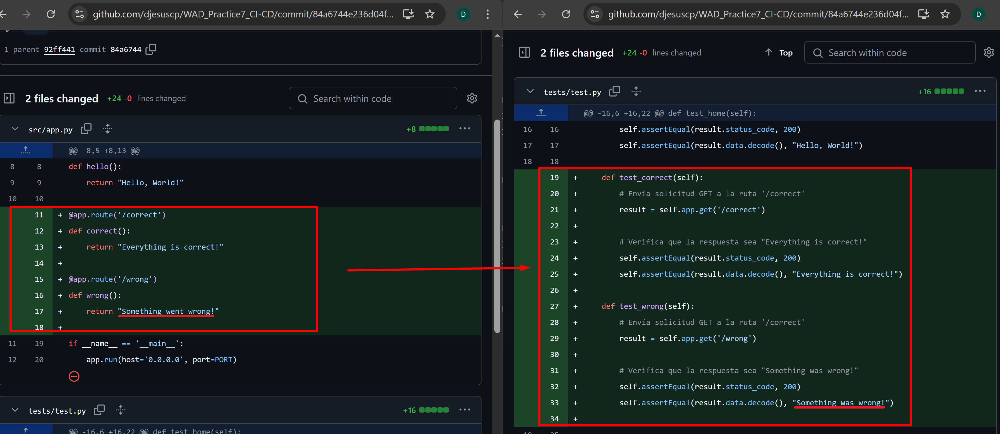

Como se ha explicado en la práctica anterior, después de cada "git push", se inicia un nuevo workflow, el cual puede ser supervisado en tiempo real desde la pestaña "Actions" en el repositorio de GitHub del usuario.

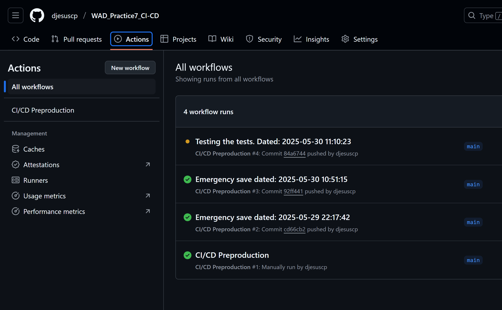

Por supuesto, como se había previsto, uno de los test falla.

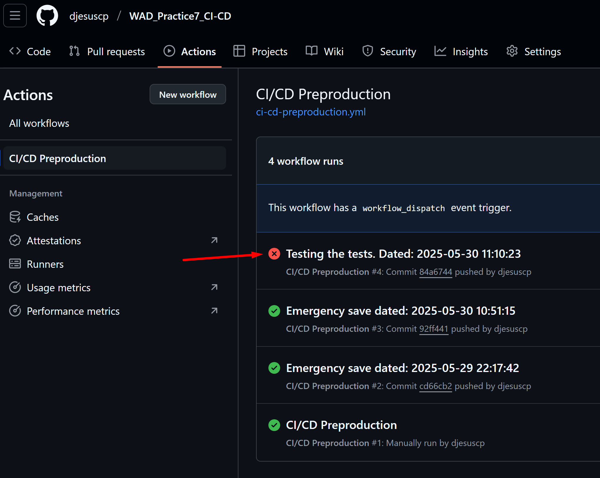

Si el usuario decide acceder al flujo de operación del workflow, dentro del apartado de "test", podrá observar el registro de los test que proporciona información sobre el lugar del fallo, y el motivo del mismo.

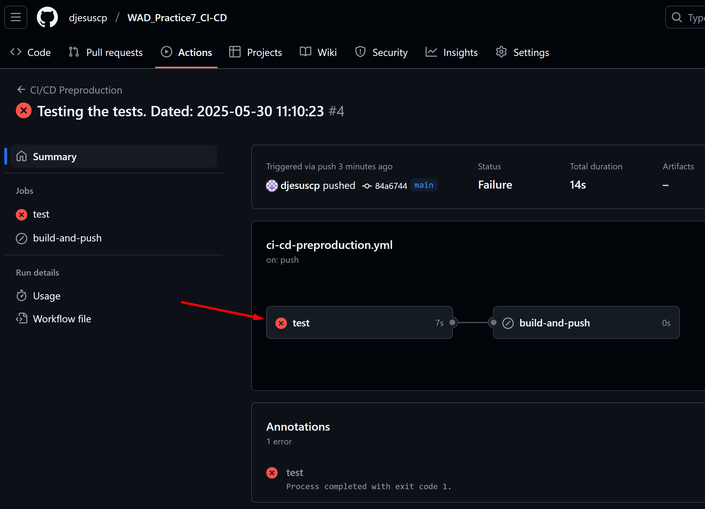
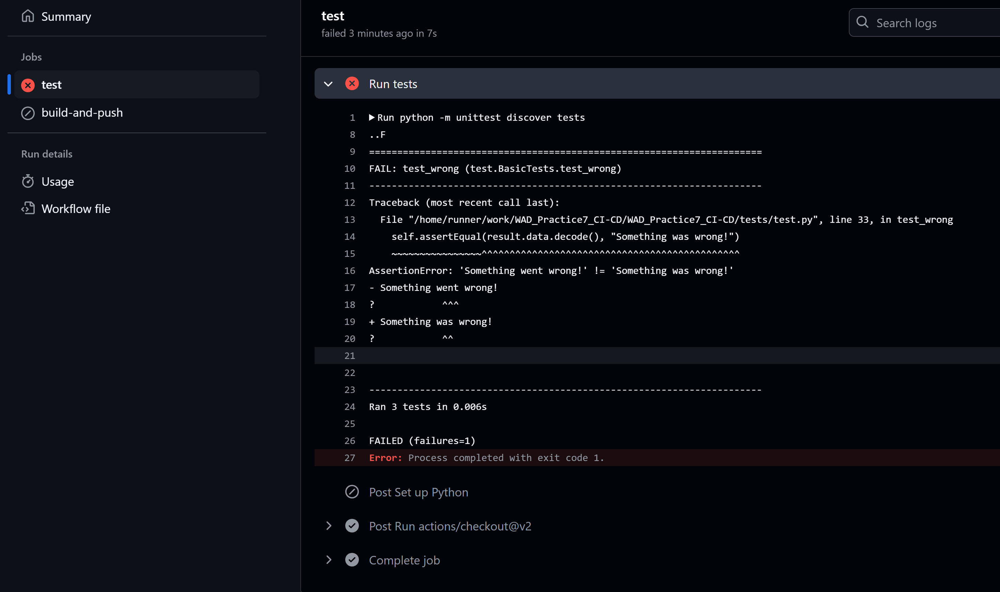

Del mismo modo, el propio registro de commits informa al usuario de que ha surgido un error.

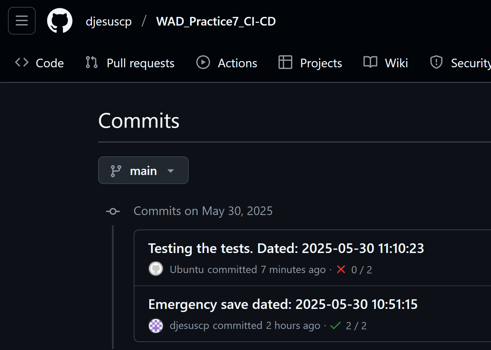

### 4.3. Comprobación de nuevos test. Test correctos.

Ahora, si el usuario, en un caso práctico y gracias a esta integración CI-CD localizase correctamente los errores detectados en los test, podría corregirlos modificando el código de su aplicación. En este caso, se han llevado a cabo las modificaciones necesarias tal como se muestra en la siguiente imagen.

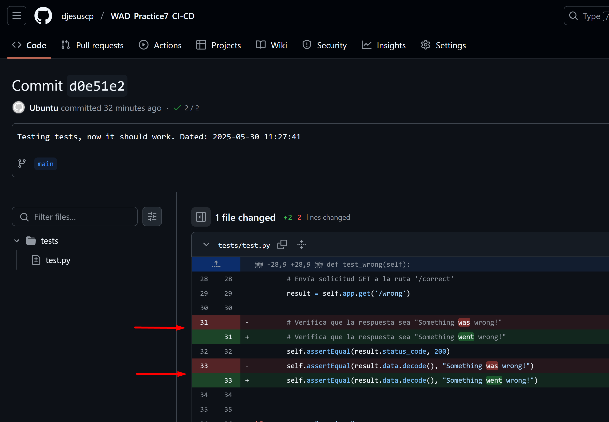

De este modo, cuando el usuario realice el siguiente "git push", dentro de su pestaña "Actions" de su repositorio GitHub, podrá comprobar que los test han pasado correctamente, lo que ha dado lugar al comienzo de la construcción de la nueva imagen para su publicación automática en Docker Hub (build and push).

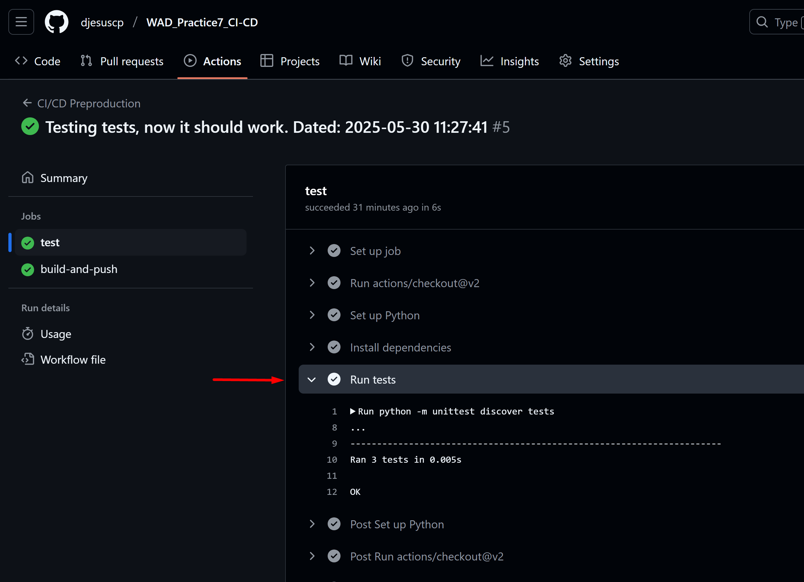
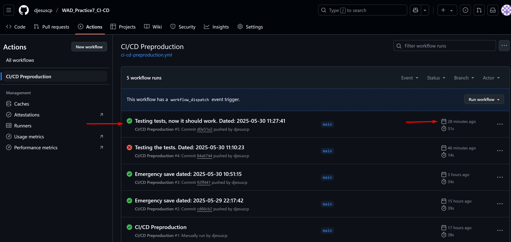
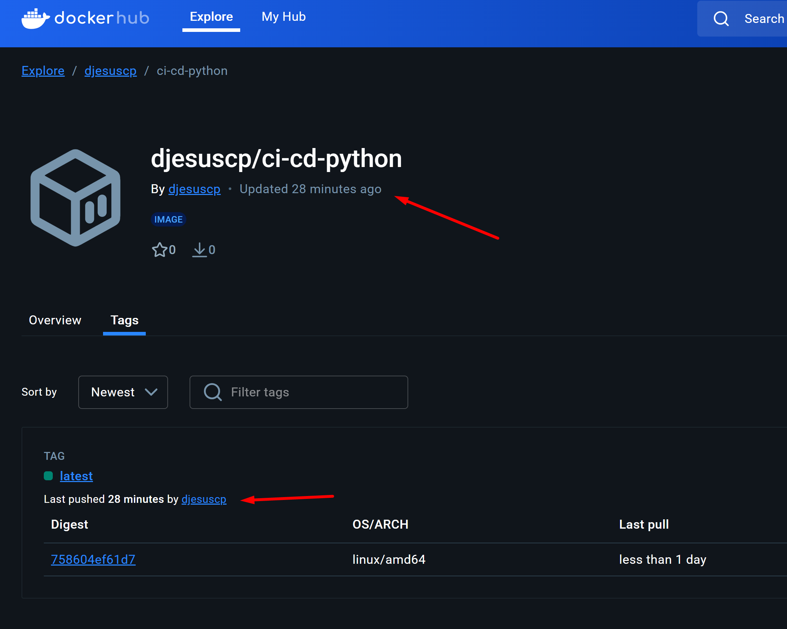
